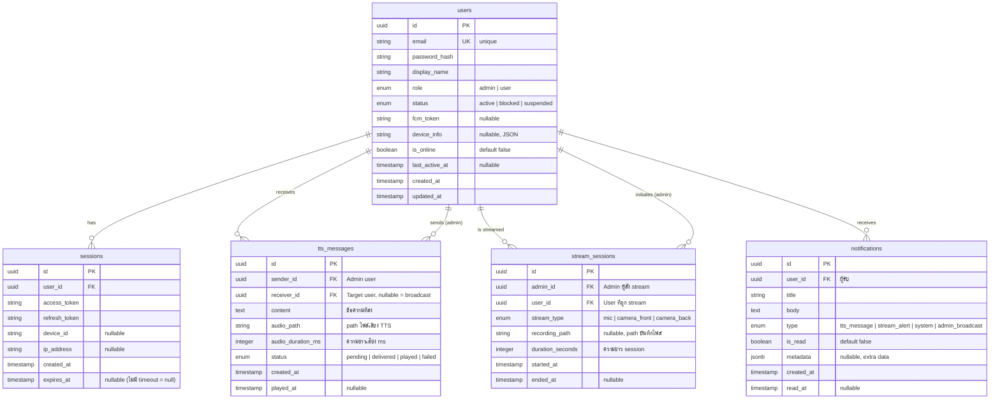

# 🗄️ ARIA System — Database ERD

> **วันที่:** 10/03/2026
> **Database:** PostgreSQL 16+
> **ORM:** SQLAlchemy 2.0 (async)

---

## ERD Diagram



---

## Table Details

### 1. `users`

| Column | Type | Constraints | หมายเหตุ |
|---|---|---|---|
| id | UUID | PK, default gen_random_uuid() | |
| email | VARCHAR(255) | UNIQUE, NOT NULL | ใช้ login |
| password_hash | VARCHAR(255) | NOT NULL | bcrypt hash |
| display_name | VARCHAR(100) | NOT NULL | ชื่อแสดง |
| role | ENUM('admin','user') | NOT NULL, default 'user' | |
| status | ENUM('active','blocked','suspended') | NOT NULL, default 'active' | Admin จัดการได้ |
| fcm_token | VARCHAR(255) | NULLABLE | Firebase token สำหรับ push |
| device_info | JSONB | NULLABLE | {model, os_version, app_version} |
| is_online | BOOLEAN | default FALSE | อัปเดตตาม WebSocket connection |
| last_active_at | TIMESTAMP | NULLABLE | อัปเดตทุกครั้งที่มี activity |
| created_at | TIMESTAMP | NOT NULL, default NOW() | |
| updated_at | TIMESTAMP | NOT NULL, default NOW() | |

**Indexes:**
- `idx_users_email` ON email
- `idx_users_role` ON role
- `idx_users_status` ON status

---

### 2. `sessions`

| Column | Type | Constraints | หมายเหตุ |
|---|---|---|---|
| id | UUID | PK | |
| user_id | UUID | FK → users(id) ON DELETE CASCADE | |
| access_token | TEXT | NOT NULL | JWT access token |
| refresh_token | TEXT | NOT NULL | JWT refresh token |
| device_id | VARCHAR(255) | NULLABLE | ระบุ device |
| ip_address | VARCHAR(45) | NULLABLE | IPv4/IPv6 |
| created_at | TIMESTAMP | NOT NULL | |
| expires_at | TIMESTAMP | NULLABLE | NULL = ไม่มี timeout |

**Indexes:**
- `idx_sessions_user_id` ON user_id
- `idx_sessions_refresh_token` ON refresh_token

---

### 3. `tts_messages`

| Column | Type | Constraints | หมายเหตุ |
|---|---|---|---|
| id | UUID | PK | |
| sender_id | UUID | FK → users(id) | Admin ผู้ส่ง |
| receiver_id | UUID | FK → users(id), NULLABLE | NULL = broadcast ถึงทุกคน |
| content | TEXT | NOT NULL | ข้อความ TTS |
| audio_path | VARCHAR(500) | NOT NULL | เช่น /storage/audio/2026-03-10/abc.wav |
| audio_duration_ms | INTEGER | NULLABLE | ความยาว ms |
| status | ENUM('pending','delivered','played','failed') | NOT NULL, default 'pending' | |
| created_at | TIMESTAMP | NOT NULL | |
| played_at | TIMESTAMP | NULLABLE | เวลาที่ User เล่นเสียง |

**Indexes:**
- `idx_tts_messages_receiver_id` ON receiver_id
- `idx_tts_messages_created_at` ON created_at DESC

---

### 4. `stream_sessions`

| Column | Type | Constraints | หมายเหตุ |
|---|---|---|---|
| id | UUID | PK | |
| admin_id | UUID | FK → users(id) | Admin ผู้สั่ง |
| user_id | UUID | FK → users(id) | User ที่ถูก stream |
| stream_type | ENUM('mic','camera_front','camera_back') | NOT NULL | |
| recording_path | VARCHAR(500) | NULLABLE | path ไฟล์บันทึก |
| duration_seconds | INTEGER | NULLABLE | คำนวณจาก started_at - ended_at |
| started_at | TIMESTAMP | NOT NULL | |
| ended_at | TIMESTAMP | NULLABLE | NULL = กำลัง stream อยู่ |

**Indexes:**
- `idx_stream_sessions_user_id` ON user_id
- `idx_stream_sessions_started_at` ON started_at DESC

---

### 5. `notifications`

| Column | Type | Constraints | หมายเหตุ |
|---|---|---|---|
| id | UUID | PK | |
| user_id | UUID | FK → users(id) ON DELETE CASCADE | |
| title | VARCHAR(255) | NOT NULL | |
| body | TEXT | NOT NULL | |
| type | ENUM('tts_message','stream_alert','system','admin_broadcast') | NOT NULL | |
| is_read | BOOLEAN | default FALSE | |
| metadata | JSONB | NULLABLE | เช่น {message_id: "..."} |
| created_at | TIMESTAMP | NOT NULL | |
| read_at | TIMESTAMP | NULLABLE | |

**Indexes:**
- `idx_notifications_user_id_read` ON (user_id, is_read)
- `idx_notifications_created_at` ON created_at DESC

---

## Seed Data

```sql
-- Admin account (seed เมื่อ setup ครั้งแรก)
INSERT INTO users (id, email, password_hash, display_name, role, status)
VALUES (
    gen_random_uuid(),
    'admin@aria.local',
    '$2b$12$...', -- bcrypt hash ของ password ที่ตั้ง
    'ARIA Admin',
    'admin',
    'active'
);
```

---

*DB ERD — ARIA System v1.0*
