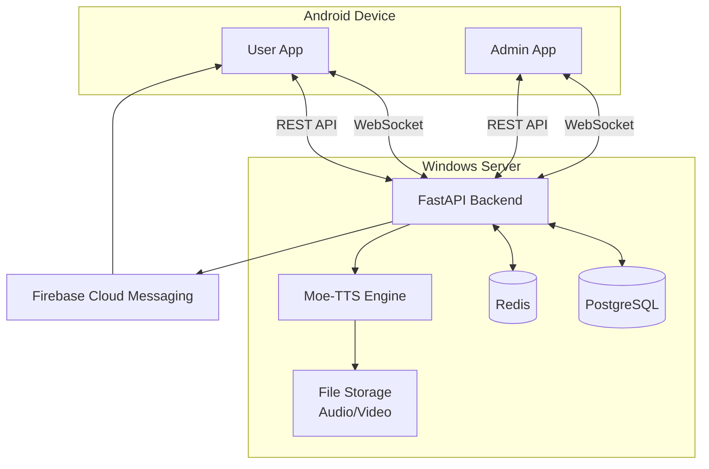

# 📄 ARIA System — Software Requirements Specification (SRS)

> **Version:** 1.0
> **วันที่:** 10/03/2026
> **สถานะ:** Draft

---

## 1. บทนำ (Introduction)

### 1.1 วัตถุประสงค์
ARIA (Adaptive Remote Intelligence Assistant) เป็นระบบควบคุมและสื่อสารกับ Android Device จากระยะไกล ผ่าน Admin Panel ที่สามารถฟังเสียง ดูกล้อง และส่งข้อความเสียง TTS ไปยัง User Device

### 1.2 ขอบเขต
- Android App (Kotlin + Jetpack Compose) สำหรับ User และ Admin
- Backend Server (FastAPI + PostgreSQL) รันบน Windows PC ส่วนตัว
- TTS Engine (Moe-TTS / VITS) รันบน Server เดียวกัน
- รองรับ 1-5 User พร้อมกัน
- ใช้ภายในกลุ่มส่วนตัว (ไม่ขึ้น Play Store)

### 1.3 คำจำกัดความ
| คำ | ความหมาย |
|---|---|
| **Admin** | ผู้ควบคุมระบบ (คนเดียว) สามารถฟังเสียง ดูกล้อง ส่ง TTS |
| **User** | ผู้ใช้ Android App ที่ถูกควบคุม/รับข้อความ |
| **TTS** | Text-to-Speech — แปลงข้อความเป็นเสียง Moe-TTS |
| **Stream** | การส่ง Audio/Video แบบ Real-time ผ่าน WebSocket |

---

## 2. ภาพรวมระบบ (System Overview)

### 2.1 สถาปัตยกรรมระดับสูง



### 2.2 User Roles

| Role | จำนวน | สิทธิ์ |
|---|---|---|
| Admin | 1 คน (เจ้าของระบบ) | ควบคุมทั้งหมด: ฟังไมค์, เปิดกล้อง, ส่ง TTS, จัดการ User |
| User | 1-5 คน | รับ TTS, รับ Notification, ถูก stream audio/video |

---

## 3. Functional Requirements

### 3.1 FR-AUTH: ระบบ Authentication

| ID | Requirement | Priority |
|---|---|---|
| FR-AUTH-01 | User สมัครด้วย Email/Password | Must |
| FR-AUTH-02 | Login ด้วย Email/Password → รับ JWT (access + refresh token) | Must |
| FR-AUTH-03 | JWT ไม่มี timeout — ใช้ได้จนกว่าจะ Logout | Must |
| FR-AUTH-04 | Refresh token auto-renew ผ่าน OkHttp interceptor | Must |
| FR-AUTH-05 | Admin account hardcode/seed ในระบบ | Must |
| FR-AUTH-06 | Login หลาย Device พร้อมกันได้ | Must |
| FR-AUTH-07 | Biometric Login (ลายนิ้วมือ) | Nice to have |

### 3.2 FR-USER: ระบบจัดการ User

| ID | Requirement | Priority |
|---|---|---|
| FR-USER-01 | Admin ดูรายชื่อ User ทั้งหมด (online/offline status) | Must |
| FR-USER-02 | Admin Block/Suspend User ได้ | Must |
| FR-USER-03 | Admin ดูรายละเอียด User (last active, device info) | Should |
| FR-USER-04 | Admin ดูประวัติ stream sessions ของ User | Should |

### 3.3 FR-MIC: ระบบฟังไมโครโฟน

| ID | Requirement | Priority |
|---|---|---|
| FR-MIC-01 | Admin เลือก User แล้วกด Listen → เริ่ม stream audio ทันที | Must |
| FR-MIC-02 | ไม่ต้องขออนุญาต User — Admin ฟังได้เลย | Must |
| FR-MIC-03 | Audio ส่งแบบ Real-time ผ่าน WebSocket | Must |
| FR-MIC-04 | บันทึก audio ไว้ใน Server (file storage) | Must |
| FR-MIC-05 | Background listening — ฟังได้แม้ User ปิดแอป/ล็อคหน้าจอ | Must |
| FR-MIC-06 | ไม่แสดง indicator ให้ User เห็นว่ากำลังถูกฟัง | Must |
| FR-MIC-07 | Admin เห็น waveform ขณะฟัง | Should |

### 3.4 FR-CAM: ระบบกล้อง

| ID | Requirement | Priority |
|---|---|---|
| FR-CAM-01 | Admin เลือก User แล้วกด Camera → เริ่ม stream video ทันที | Must |
| FR-CAM-02 | ไม่ต้องขออนุญาต User | Must |
| FR-CAM-03 | สลับกล้องหน้า/หลังได้ (Admin toggle) | Must |
| FR-CAM-04 | Real-time video stream (480p) ผ่าน WebSocket | Must |
| FR-CAM-05 | บันทึก video ไว้ใน Server | Must |
| FR-CAM-06 | ไม่แสดง indicator ให้ User เห็น | Must |
| FR-CAM-07 | Admin กด Snapshot ถ่ายรูปได้ | Should |

### 3.5 FR-TTS: ระบบ Text-to-Speech

| ID | Requirement | Priority |
|---|---|---|
| FR-TTS-01 | Admin พิมพ์ข้อความ → Moe-TTS generate เสียง → ส่งไป User | Must |
| FR-TTS-02 | User เล่นเสียง Auto-play ทันทีที่ได้รับ | Must |
| FR-TTS-03 | หลาย message → Queue เล่นต่อกันอัตโนมัติ | Must |
| FR-TTS-04 | เก็บประวัติ TTS messages ไม่จำกัด | Must |
| FR-TTS-05 | Admin สั่ง Clear ประวัติ messages ได้ | Must |
| FR-TTS-06 | ใช้เสียงตาม Moe-TTS ที่ตั้งไว้ (User เลือกเองไม่ได้) | Must |
| FR-TTS-07 | Admin Preview เสียงก่อนส่งได้ | Should |
| FR-TTS-08 | Typewriter text animation ขณะเล่นเสียง | Should |
| FR-TTS-09 | Audio waveform visualizer | Should |

### 3.6 FR-NOTIFY: ระบบ Notification

| ID | Requirement | Priority |
|---|---|---|
| FR-NOTIFY-01 | In-App notification | Must |
| FR-NOTIFY-02 | FCM Push Notification (แม้ปิดแอป) | Must |
| FR-NOTIFY-03 | Admin ส่ง Broadcast notification ถึง User ทุกคน | Must |
| FR-NOTIFY-04 | เก็บประวัติ Notification | Must |
| FR-NOTIFY-05 | Notification types: TTS message, System alert, Admin broadcast | Must |

### 3.7 FR-UI: ระบบ User Interface

| ID | Requirement | Priority |
|---|---|---|
| FR-UI-01 | Dark Mode อย่างเดียว — Sci-fi/HUD/Neon theme | Must |
| FR-UI-02 | ภาษาไทยหลัก | Must |
| FR-UI-03 | Onboarding Screen สำหรับ User ใหม่ | Must |
| FR-UI-04 | รองรับ Tablet | Must |
| FR-UI-05 | Splash Screen + animated ARIA logo | Should |
| FR-UI-06 | GlowCard, AriaButton, HUD Panel components | Should |
| FR-UI-07 | Background particle/grid effect | Nice to have |

---

## 4. Non-Functional Requirements

### 4.1 NFR-PERF: Performance

| ID | Requirement |
|---|---|
| NFR-PERF-01 | Audio stream latency < 2 วินาที |
| NFR-PERF-02 | Video stream latency < 3 วินาที (480p) |
| NFR-PERF-03 | TTS generation < 10 วินาที ต่อข้อความ |
| NFR-PERF-04 | API response time < 500ms |

### 4.2 NFR-RELY: Reliability

| ID | Requirement |
|---|---|
| NFR-RELY-01 | WebSocket auto-reconnect เมื่อ network หลุด |
| NFR-RELY-02 | หยุด stream + แจ้ง Admin เมื่อ User ถอน permission |
| NFR-RELY-03 | แสดง Error ให้ Admin เมื่อ TTS Server ล่ม (ไม่มี fallback) |

### 4.3 NFR-SEC: Security

| ID | Requirement |
|---|---|
| NFR-SEC-01 | Password hash ด้วย bcrypt |
| NFR-SEC-02 | JWT authentication สำหรับทุก API |
| NFR-SEC-03 | Role-based access control (Admin vs User) |
| NFR-SEC-04 | EncryptedSharedPreferences สำหรับเก็บ JWT บน Android |

### 4.4 NFR-DEPLOY: Deployment

| ID | Requirement |
|---|---|
| NFR-DEPLOY-01 | รันบน Windows PC ส่วนตัว (ไม่ใช้ Docker) |
| NFR-DEPLOY-02 | ไม่ต้องการ CI/CD |
| NFR-DEPLOY-03 | ไม่ต้องการ DB Backup อัตโนมัติ |
| NFR-DEPLOY-04 | ไม่ต้องการ Monitoring/Alerting |
| NFR-DEPLOY-05 | เผยแพร่ APK โดยตรง (ไม่ขึ้น Play Store) |

---

## 5. Use Cases สำคัญ

### UC-01: Admin ฟังไมค์ User
```
Actor: Admin
Precondition: Admin login แล้ว, User online
Flow:
1. Admin เปิด Dashboard → เห็น User List
2. Admin เลือก User → กด "Listen"
3. Backend ส่ง WebSocket command ไป User device
4. User device เปิดไมค์ → stream audio chunks ผ่าน WebSocket
5. Admin ได้ยินเสียง real-time + เห็น waveform
6. Backend บันทึก audio ไว้ใน file storage
7. Admin กด "Stop" → หยุด stream
```

### UC-02: Admin เปิดกล้อง User
```
Actor: Admin
Precondition: Admin login แล้ว, User online
Flow:
1. Admin เลือก User → กด "Camera"
2. Backend ส่ง WebSocket command ไป User device
3. User device เปิดกล้อง (เริ่มจากกล้องหลัง) → stream JPEG frames
4. Admin เห็น video feed real-time
5. Admin สามารถ toggle กล้องหน้า/หลัง
6. Admin สามารถกด Snapshot ถ่ายรูป
7. Backend บันทึก video ไว้ใน file storage
```

### UC-03: Admin ส่ง TTS Voice Message
```
Actor: Admin
Precondition: Admin login แล้ว
Flow:
1. Admin เปิด TTS Composer → พิมพ์ข้อความ
2. Admin กด "Preview" → ฟังเสียงก่อน (optional)
3. Admin เลือก User (หรือ broadcast) → กด "Transmit"
4. Backend เรียก Moe-TTS → generate audio file
5. Backend บันทึก message + audio_path ใน DB
6. Backend ส่ง WebSocket event NEW_MESSAGE + FCM push
7. User device download audio → Auto-play + แสดง typewriter text
8. ถ้ามีหลาย message → Queue เล่นต่อกัน
```

### UC-04: User สมัครและ Login
```
Actor: User
Flow:
1. User เปิดแอป → เห็น Onboarding Screen (ครั้งแรก)
2. User กด "สมัคร" → กรอก Email/Password
3. Backend สร้าง account → return JWT
4. User เข้าสู่ Dashboard
5. ครั้งต่อไปเปิดแอป → Auto-login (มี token อยู่แล้ว)
```

---

## 6. ข้อจำกัดและสมมติฐาน

### ข้อจำกัด
- Server รันบน Windows PC ส่วนตัว — ต้องเปิดเครื่องตลอดเวลา
- ไม่มี Domain — ใช้ IP หรือ Ngrok/Cloudflare Tunnel
- Moe-TTS ต้องการ GPU สำหรับ inference ที่รวดเร็ว
- Android 14 (API 34) minimum — จำกัดจำนวน device ที่รองรับ

### สมมติฐาน
- Admin มีคนเดียว ไม่ต้องจัดการ admin หลายคน
- Network ระหว่าง User device กับ Server เสถียรพอสมควร
- User ยินยอมให้ถูก stream audio/video (consent จัดการนอกระบบ)

---

*SRS Document v1.0 — ARIA System*
