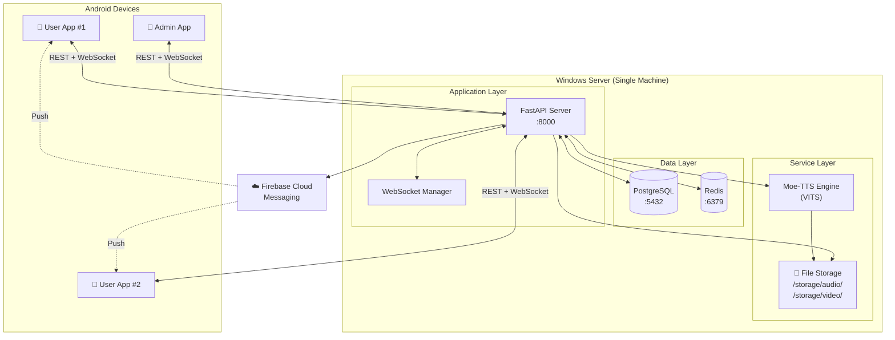
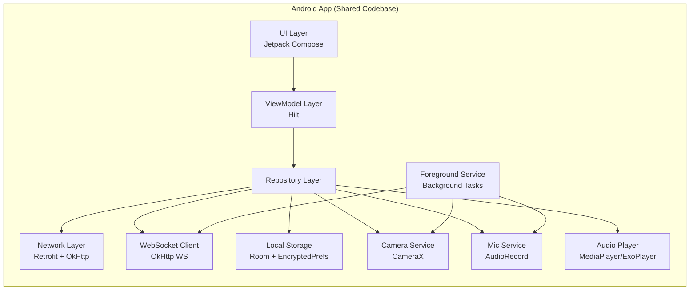
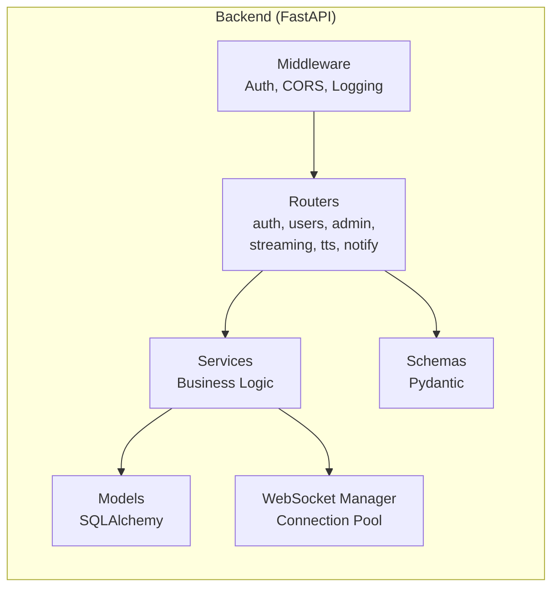
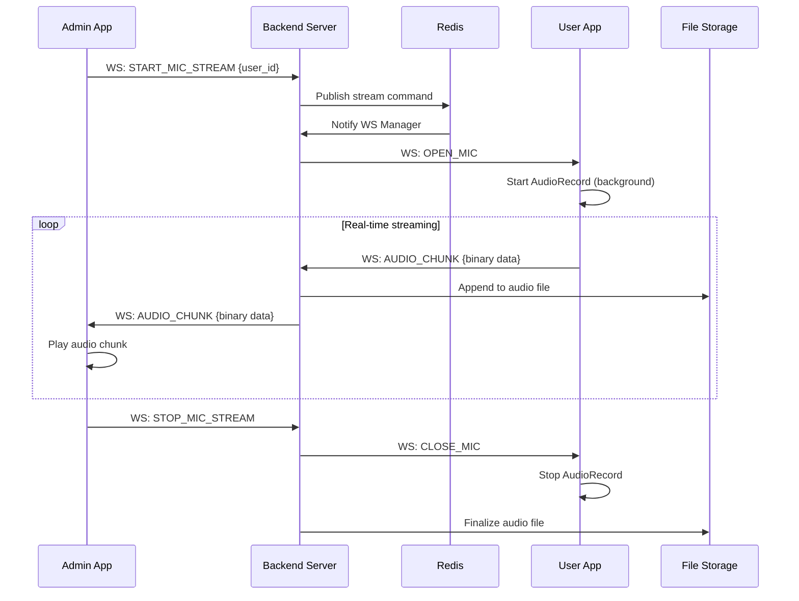
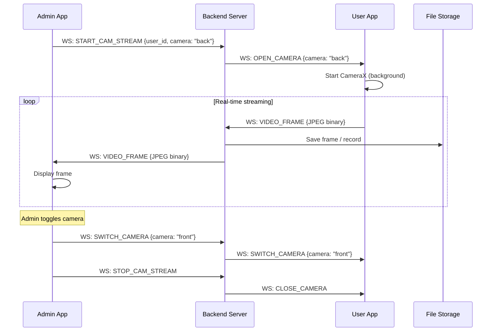
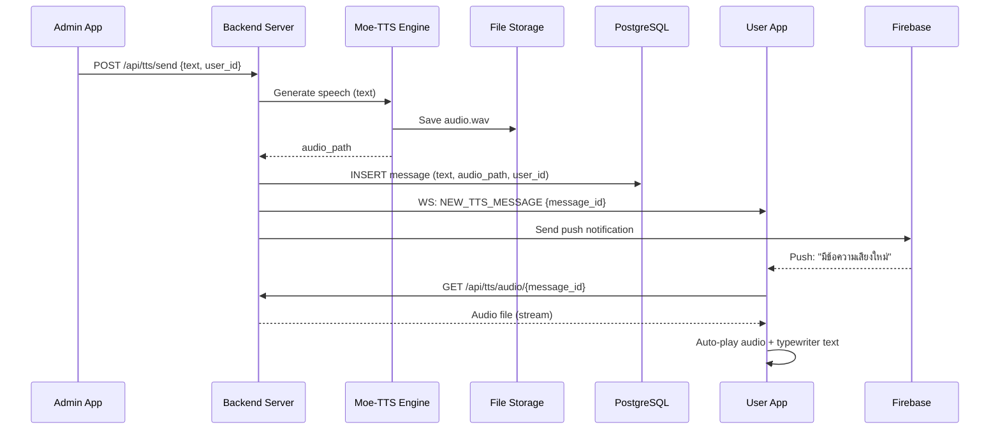
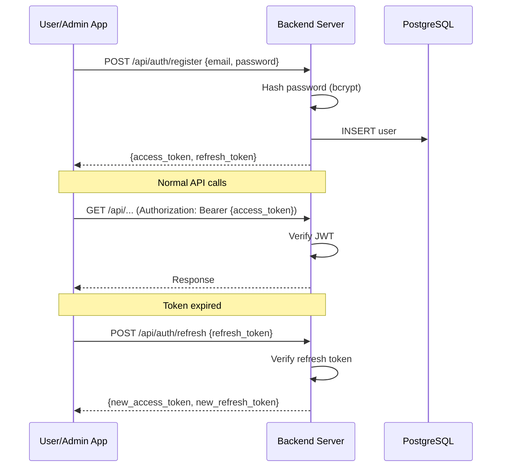

# 🏗️ ARIA System — System Architecture

> **วันที่:** 10/03/2026

---

## 1. High-Level Architecture



---

## 2. Component Diagram





---

## 3. Data Flow Diagrams

### 3.1 Audio Streaming Flow



### 3.2 Video Streaming Flow



### 3.3 TTS Message Flow



### 3.4 Authentication Flow



---

## 4. Backend Project Structure

```
aria-backend/
├── main.py                    # FastAPI app entry point
├── config.py                  # Settings & environment
├── database.py                # DB connection & session
│
├── routers/
│   ├── auth.py                # /api/auth/*
│   ├── users.py               # /api/users/*
│   ├── admin.py               # /api/admin/*
│   ├── streaming.py           # /api/streaming/*
│   ├── tts.py                 # /api/tts/*
│   └── notifications.py       # /api/notifications/*
│
├── services/
│   ├── auth_service.py        # Login, register, JWT
│   ├── user_service.py        # User CRUD
│   ├── streaming_service.py   # Audio/Video stream mgmt
│   ├── tts_service.py         # Moe-TTS integration
│   ├── notification_service.py # FCM + in-app
│   └── websocket_manager.py   # WS connection pool
│
├── models/
│   ├── user.py                # User model
│   ├── message.py             # TTS message model
│   ├── stream_session.py      # Stream session model
│   └── notification.py        # Notification model
│
├── schemas/
│   ├── auth.py                # Auth request/response
│   ├── user.py                # User schemas
│   ├── message.py             # TTS message schemas
│   └── notification.py        # Notification schemas
│
├── middleware/
│   ├── auth.py                # JWT verification
│   └── cors.py                # CORS configuration
│
├── storage/
│   ├── audio/                 # Recorded audio files
│   └── video/                 # Recorded video files
│
├── alembic/                   # DB migrations
│   ├── versions/
│   └── env.py
│
├── alembic.ini
└── requirements.txt
```

---

## 5. Android Project Structure

```
aria-android/
├── app/src/main/java/com/aria/system/
│   ├── ARIAApplication.kt         # Hilt Application
│   ├── MainActivity.kt            # Single Activity
│   │
│   ├── di/                         # Dependency Injection
│   │   ├── AppModule.kt
│   │   └── NetworkModule.kt
│   │
│   ├── data/
│   │   ├── remote/
│   │   │   ├── api/               # Retrofit interfaces
│   │   │   │   ├── AuthApi.kt
│   │   │   │   ├── UserApi.kt
│   │   │   │   ├── TtsApi.kt
│   │   │   │   └── NotificationApi.kt
│   │   │   ├── websocket/
│   │   │   │   └── AriaWebSocket.kt
│   │   │   └── interceptor/
│   │   │       └── AuthInterceptor.kt
│   │   ├── local/
│   │   │   ├── db/                # Room Database
│   │   │   └── prefs/             # EncryptedSharedPrefs
│   │   └── repository/
│   │       ├── AuthRepository.kt
│   │       ├── StreamRepository.kt
│   │       ├── TtsRepository.kt
│   │       └── NotificationRepository.kt
│   │
│   ├── domain/
│   │   └── model/                  # Domain models
│   │
│   ├── service/
│   │   ├── StreamingService.kt     # Foreground Service (mic+cam)
│   │   └── FCMService.kt          # Firebase messaging
│   │
│   ├── ui/
│   │   ├── theme/                  # Dark theme, colors, typography
│   │   ├── components/             # Reusable composables
│   │   │   ├── GlowCard.kt
│   │   │   ├── AriaButton.kt
│   │   │   └── WaveformVisualizer.kt
│   │   ├── navigation/
│   │   │   └── AriaNavGraph.kt
│   │   ├── onboarding/             # Onboarding screens
│   │   ├── auth/                   # Login/Register
│   │   ├── dashboard/              # Main dashboard
│   │   ├── admin/                  # Admin panel
│   │   │   ├── UserListScreen.kt
│   │   │   ├── StreamViewScreen.kt
│   │   │   └── TtsComposerScreen.kt
│   │   └── user/                   # User screens
│   │       ├── HomeScreen.kt
│   │       └── NotificationScreen.kt
│   │
│   └── util/                       # Utilities
│
├── app/src/main/res/               # Resources
└── build.gradle.kts
```

---

## 6. Network & Port Configuration

| Service | Port | Protocol |
|---|---|---|
| FastAPI (HTTP + WS) | 8000 | HTTP/1.1 + WebSocket |
| PostgreSQL | 5432 | TCP |
| Redis | 6379 | TCP |
| Moe-TTS (internal) | — | Function call (same process) |

**External Access:** Ngrok หรือ Cloudflare Tunnel → Forward port 8000

---

*System Architecture — ARIA System v1.0*
